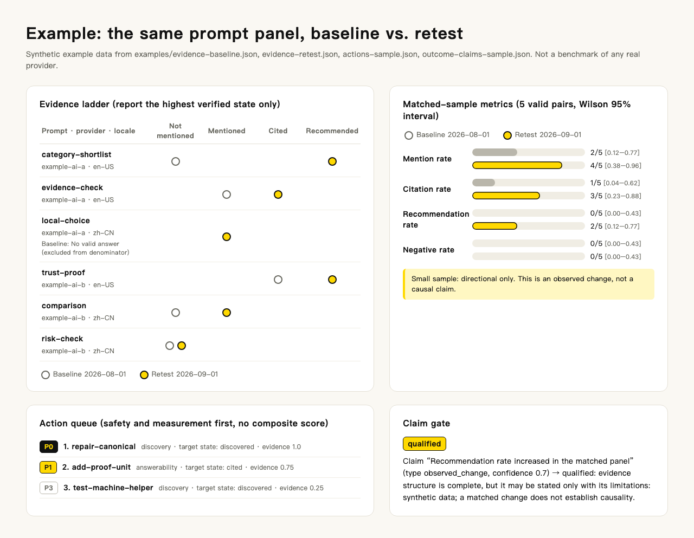
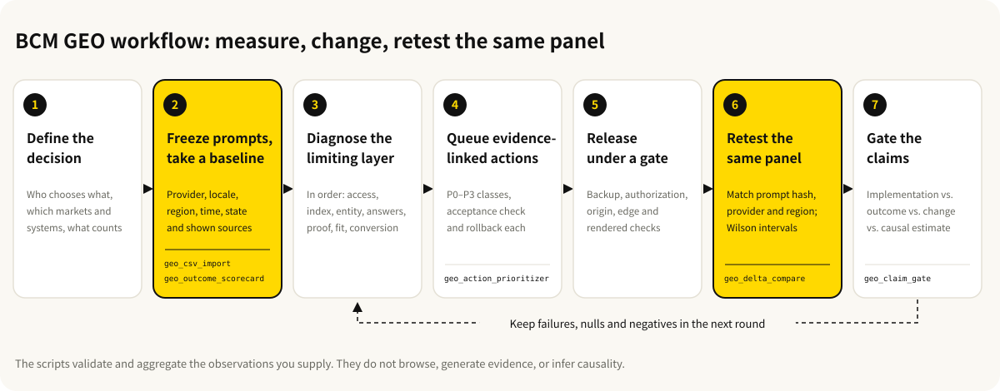

<p align="center">
  
</p>

# BCM GEO Outcome Engine（GEO 效果优化）

[简体中文（主文档）](README.zh-CN.md) · **English**

> 中文读者请直接阅读 [简体中文说明](README.zh-CN.md)：内容与本页对等，国内可从 [Gitee 镜像](https://gitee.com/baocanmou/bcm-geo-optimizer) 克隆。

[](https://github.com/baocanmou/bcm-geo-optimizer/actions/workflows/ci.yml)
[](VERSION)
[](LICENSE)
[](scripts)
[](https://gitee.com/baocanmou/bcm-geo-optimizer)

A Generative Engine Optimization (GEO) Skill for Codex, Claude Code and compatible coding agents. It helps brand owners, marketers and agencies find out whether a brand is actually mentioned, cited or recommended in AI answers and search results, turns those observations into evidence-ranked improvement tasks, and retests the same prompts to see what changed.

It answers one question:

> Did the work produce an externally observable mention, citation, recommendation, qualified visit, lead, or sale?

## Who it is for and when to use it

- **You shipped `llms.txt`, structured data and URL submissions, and AI still does not recommend you**: find the layer that is actually blocking before deciding what to change.
- **You are starting a GEO project**: build a baseline with a fixed prompt panel across ChatGPT, Gemini, Perplexity, Google, Bing, Baidu and other observable systems, then plan 30/60/90-day work.
- **You redesigned pages or published content and want to know whether anything changed**: retest the same prompts, compare matched samples only, and keep observed change separate from causality.
- **You need to report GEO results to a client or manager, or publish a case study**: run the claim gate first to check whether each statement has enough evidence.

## What it does

At the core is an evidence ladder. It reports the highest directly verified state and never skips a step by inference:

```text
reachable -> discovered -> crawled -> indexed -> ranked
          -> mentioned -> cited -> recommended -> converted
```

- **Separates implementation from outcomes**: HTTP 200, a submission receipt, a live `llms.txt` or a high audit score are implementation signals, not indexing or AI adoption.
- **Fixed prompt panel**: category discovery, comparison, problem/solution, trust and proof, local, branded verification and negative-risk prompts; every observation records provider, model, locale, region, time, state, sources actually shown, and limitations.
- **Layer-by-layer diagnosis**: access and discovery, indexing and retrieval, entity clarity, answerability, independent corroboration, recommendation fit, conversion continuity, stopping at the highest blocker.
- **Evidence-linked actions**: each task states the observed gap, evidence, target state, acceptance check, owner, risk and rollback, classed P0–P3, with no composite "GEO score".
- **Controlled release**: for live-site changes, backup, smallest scoped change, origin, public edge, rendered DOM, receipts, monitoring and rollback are checked separately; an audit request does not authorize changes.
- **Matched retest**: comparisons require the same prompt hash, provider, locale and region; outputs mention, citation, recommendation and negative rates with Wilson 95% intervals and flag small samples as directional.
- **Claim gate**: conclusions are typed as implementation, search outcome, AI outcome, observed change or causal estimate, each with its own evidence threshold.
- **Multi-site governance**: one preferred site and page per commercial intent, to avoid your own sites competing for the same query.
- **Multilingual diagnostics**: Chinese and other languages are evaluated with locale-aware rules, not English word-count or capitalization heuristics.
- **Authorized browser evidence** (v1.3.0): AI answers captured in a signed-in browser you authorized must record the collection method, capture reference and SHA-256 of the original file; captchas, logins, submissions, uploads and account settings are handed back to you.
- **Offline scripts**: six deterministic Python scripts, standard library only, no API keys, no network calls.

## Example

Everything in the figure comes from the synthetic example files in this repository ([`evidence-baseline.json`](examples/evidence-baseline.json), [`evidence-retest.json`](examples/evidence-retest.json), [`actions-sample.json`](examples/actions-sample.json), [`outcome-claims-sample.json`](examples/outcome-claims-sample.json)). The numbers were computed by the repository scripts and do not describe any real provider.



How to read it:

- Of six prompts, `local-choice` had no valid answer at baseline and is excluded from the denominator, leaving 5 valid pairs.
- Across those 5 pairs, recommendations went from 0/5 to 2/5 and citations from 1/5 to 3/5. The Wilson intervals are wide and the script emits `small_matched_sample_directional_only`, so this is directional only.
- The action queue puts "repair a conflicting canonical" (P0, discovery) ahead of "add an evidence unit to a key claim" (P1). "Test a machine-readable helper" has evidence strength 0.25 and comes last, as a bounded experiment.
- The claim "recommendation rate increased in the matched panel" has confidence 0.7, so the gate returns `qualified`: you may report an observed change, together with its limitations (synthetic data, no causality).

Reproduce it:

```bash
python3 scripts/geo_delta_compare.py \
  --baseline examples/evidence-baseline.json \
  --retest examples/evidence-retest.json \
  --output /tmp/geo-delta.json
```

## Workflow



## Install

Clone the repository into your shared agent skills directory:

```bash
git clone https://github.com/baocanmou/bcm-geo-optimizer.git \
  "$HOME/.agents/skills/bcm-geo-optimizer"
```

From mainland China, the Gitee mirror is usually faster:

```bash
git clone https://gitee.com/baocanmou/bcm-geo-optimizer.git \
  "$HOME/.agents/skills/bcm-geo-optimizer"
```

**Codex**: if Codex reads a separate skills directory, link the shared copy:

```bash
mkdir -p "$HOME/.codex/skills"
ln -s "$HOME/.agents/skills/bcm-geo-optimizer" \
  "$HOME/.codex/skills/bcm-geo-optimizer"
```

**Claude Code**: Claude Code reads personal skills from `~/.claude/skills/`; link it the same way:

```bash
mkdir -p "$HOME/.claude/skills"
ln -s "$HOME/.agents/skills/bcm-geo-optimizer" \
  "$HOME/.claude/skills/bcm-geo-optimizer"
```

Start a new agent session after installation so the skill catalog refreshes. The scripts need only Python 3 (CI covers 3.10–3.13) and have no third-party dependencies.

## Usage

Describe the task in plain language, or invoke the Skill by name (`$bcm-geo-optimizer` in Codex, `/bcm-geo-optimizer` in Claude Code).

```text
Use $bcm-geo-optimizer to establish a baseline across ChatGPT, Gemini,
Perplexity, Google, Bing and Baidu, then produce a 90-day plan with acceptance checks.
```

```text
Use $bcm-geo-optimizer to compare our baseline and retest prompt panels.
Report only matched observations and do not claim causality.
```

```text
Use $bcm-geo-optimizer with huashu-chrome to build an AI recommendation baseline
for a fixed set of short queries in my authorized browser. Hand control back to me
for any captcha, submission, upload or account setting, and hash every original capture.
```

The agent first confirms the commercial target and prompt panel, then diagnoses the limiting layer, and returns a report covering: business target and scope, verified state by engine and site, baseline panel and coverage gaps, top blockers, 30/60/90-day actions, release status (if authorized), retest result, and the next decision. States are labeled `Verified`, `Received`, `Configured`, `Inferred`, `Unknown` or `Blocked`.

For browser collection, see [authorized browser observation](references/browser-observation.md).

### Offline evidence tools

| Script | Purpose |
|---|---|
| `geo_outcome_scorecard.py` | Summarize observations into an outcome scorecard |
| `geo_delta_compare.py` | Compare baseline and retest using matched samples only |
| `geo_action_prioritizer.py` | Build a transparent, constraint-first action queue |
| `geo_csv_import.py` | Convert a spreadsheet export into an evidence bundle, rejecting unknown columns |
| `geo_privacy_export.py` | Produce a de-identified review copy |
| `geo_claim_gate.py` | Check the evidence threshold of each claim before publication |

```bash
# Outcome scorecard
python3 scripts/geo_outcome_scorecard.py \
  --input examples/evidence-sample.json \
  --output /tmp/geo-scorecard.json

# Action queue
python3 scripts/geo_action_prioritizer.py \
  --input examples/actions-sample.json \
  --output /tmp/geo-action-queue.json

# CSV import
python3 scripts/geo_csv_import.py \
  --input examples/evidence-sample.csv \
  --study-id example-study \
  --purpose "Synthetic import check" \
  --output /tmp/geo-evidence.json

# De-identified copy (salt of 16+ bytes, never committed)
export GEO_ANONYMIZATION_SALT='use-a-private-random-value-of-16-or-more-bytes'
python3 scripts/geo_privacy_export.py \
  --input /tmp/geo-evidence.json \
  --time-granularity day \
  --output /tmp/geo-evidence-public.json

# Claim gate
python3 scripts/geo_claim_gate.py \
  --input examples/outcome-claims-sample.json \
  --output /tmp/geo-claim-gate.json \
  --strict
```

Data contracts: [evidence contract](references/evidence-contract.md), [evidence bundle JSON Schema](schemas/evidence-bundle.schema.json), [action bundle JSON Schema](schemas/action-bundle.schema.json), [outcome claim JSON Schema](schemas/outcome-claim.schema.json), [data interoperability and privacy export](references/data-interoperability.md).

## Boundaries

- **It does not collect evidence for you**: the scripts validate and aggregate the observations you supply. They do not contact any provider, generate AI answers, or infer causality.
- **It does not change live sites or publish**: an audit request is not authorization. Site changes, publishing, outreach and account changes need your separate approval.
- **No fabrication**: no fake reviews, citations, mentions, backlinks or AI answers, and no circumvention of captchas, rate limits or access controls.
- **Results that need human review**:
  - small retest samples are directional only;
  - causal conclusions need a separate causal design (control, assumptions); the scripts will not produce one for you;
  - the privacy export reduces disclosure risk but cannot ensure anonymity; review residual risk before sharing;
  - provider behavior changes, so check current official documentation before acting on engine-specific advice;
  - one recommendation is not a stable recommendation, and not traffic or a sale.
- **No production system included**: this repository does not contain the BCM GEO production platform, customer data, private connectors, credentials, internal thresholds, site-specific strategy or hosted services.

## FAQ

**We already have `llms.txt` and structured data. Why does AI still not recommend us?**
Those prove implementation, not that an AI system used them. The Skill diagnoses the limiting layer first; the blocker may be indexing, inconsistent entity facts, pages without citable evidence, or a lack of independent corroboration. `llms.txt` and schema are not automatically ranked as high priority.

**Do the scripts query ChatGPT or scrape search results?**
No. They run offline, need no keys and make no network calls. Observations come from your own collection, platform exports, or a browser session you authorized.

**The retest numbers improved. Can we say the optimization caused it?**
Only that a change was observed in the matched panel. A causal estimate needs an explicit causal design, a control reference and stated assumptions. Run `geo_claim_gate.py` before publishing; a `causal_estimate` claim without a design is rejected.

**Is a retest with only a few samples meaningful?**
Yes, as directional evidence. The script reports sample sizes and Wilson intervals and warns on small samples. When matched coverage falls below the default 0.8, the comparison is labeled `insufficient_matched_coverage`.

**Can I contribute code?**
External source-code contributions are not merged until the maintainer publishes a legally reviewed contribution agreement. Issues, reproducible test cases, localization feedback and design discussion are welcome; see [CONTRIBUTING.md](CONTRIBUTING.md). Report vulnerabilities privately as described in [SECURITY.md](SECURITY.md).

## Versions and updates

Current version: **1.3.0** (2026-09-07). It adds the authorized-browser observation contract: collection-method and capture-hash validation, without treating browser execution as outcome proof.

- Change log: [CHANGELOG.md](CHANGELOG.md)
- Releases: [GitHub Releases](https://github.com/baocanmou/bcm-geo-optimizer/releases)

Self-check:

```bash
python3 scripts/validate_package.py
python3 -m unittest discover -s tests -v
```

## License and attribution

BCM's original public implementation is licensed under [MIT](LICENSE). Copyright remains with 南昌包参谋品牌策划有限公司. The MIT License covers the skill instructions, JSON Schemas, deterministic scripts, evaluations, synthetic examples and documentation in this repository. It does not include or license the BCM GEO production platform, customer data, private connectors, credentials, internal thresholds, site-specific strategy, trademarks, logos or hosted services.

`BCM GEO`, `包参谋`, `包参谋 GEO`, `BCM` and related identities are not licensed as trademarks under MIT. Accurate attribution and factual compatibility statements are permitted; modified or redistributed versions must not imply that BCM operates, approves, certifies or endorses them.

This project was designed and implemented independently around real recommendation outcomes, production verification and business attribution. It does not include source code, prompt text, scoring formulas, documentation text or visual assets copied from other GEO projects.

See: [Ownership](OWNERSHIP.md) · [Provenance](PROVENANCE.md) · [Methodology and IP boundary](references/methodology-and-ip.md) · [Third-party notices](THIRD_PARTY_NOTICES.md) · [Trademark policy](TRADEMARKS.md) · [NOTICE](NOTICE)

## Other BaoCanMou open-source projects

| Project | What it does | China mirror |
|---|---|---|
| [Restaurant Slogans: 10 Methods, 3 Picks](https://github.com/baocanmou/baocanmou-restaurant-slogan) | One restaurant tagline per method from ten masters, then three recommendations | [Gitee](https://gitee.com/baocanmou/baocanmou-restaurant-slogan) |
| [Plans into Presentations](https://github.com/baocanmou/baocanmou-plan-to-ppt) | Turns briefs and research into an editable, source-checked proposal deck | [Gitee](https://gitee.com/baocanmou/baocanmou-plan-to-ppt) |
| [Open GEO SEO Console](https://github.com/baocanmou/open-geo-seo-console) | Self-hosted SEO and GEO monitoring console | [Gitee](https://gitee.com/baocanmou/open-geo-seo-console) |
| [BaoCanMou AI Skill Center](https://github.com/baocanmou/baocanmou-ai-skill-center) | Desktop app that catalogs local AI skills and links them to AI tools | [Gitee](https://gitee.com/baocanmou/baocanmou-ai-skill-center) |

## About BaoCanMou

BaoCanMou (包参谋) — Nanchang BaoCanMou Brand Planning Co., Ltd. — is a brand strategy and design company founded in 2012 in Nanchang, Jiangxi, China. We provide brand positioning, logo and visual identity, packaging, brand space and communication content, mainly for restaurants, chain stores, packaged food and regional specialty brands. Founder: Yi Huiting.

We work positioning first, design second. These tools come from work we repeat in client projects; we write the judgment criteria down so AI can follow the same standard.
