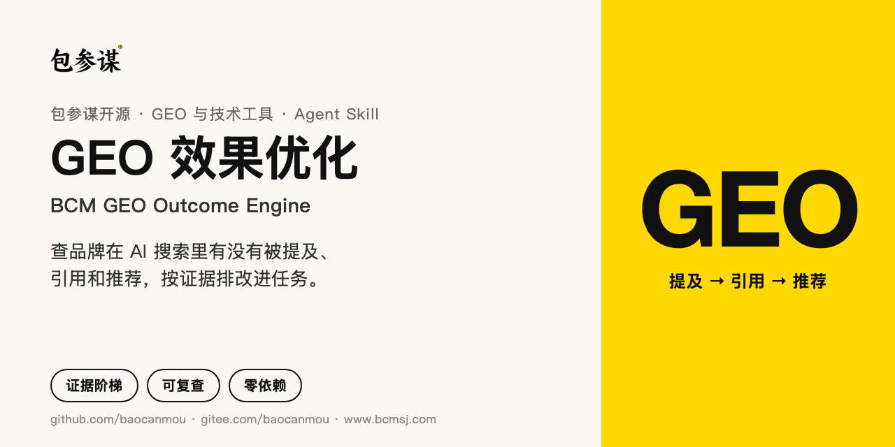
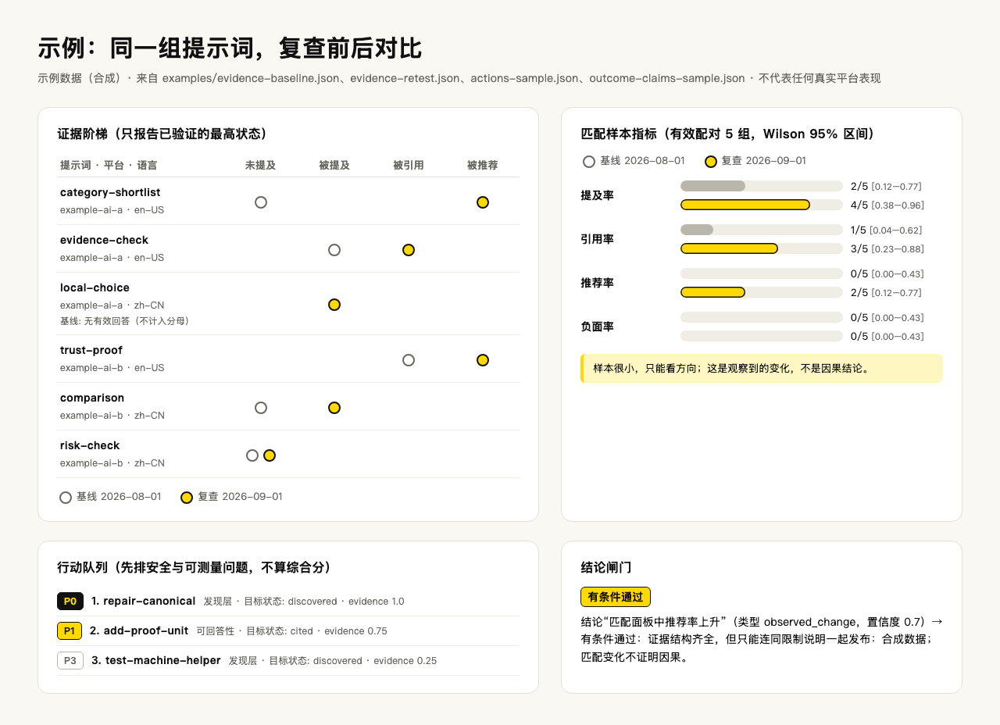
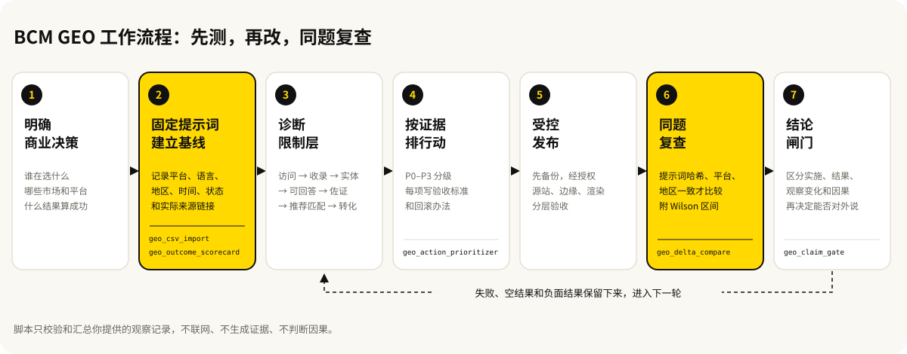

<p align="center">
  
</p>

# GEO 效果优化（BCM GEO Outcome Engine）

**简体中文** · [English](README.md)

[](https://github.com/baocanmou/bcm-geo-optimizer/actions/workflows/ci.yml)
[](VERSION)
[](LICENSE)
[](scripts)
[](https://gitee.com/baocanmou/bcm-geo-optimizer)

一个 GEO（生成式引擎优化）Skill，Claude Code、Codex、Kimi Code CLI、通义千问 Qwen Code、文心快码、TRAE、豆包/扣子都能装，不能装技能的聊天窗口也有一份聊天版提示词：帮品牌方、运营和代理团队查清品牌在 AI 回答与搜索结果里到底有没有被提及、引用、推荐，把这些观察记录变成按证据排序的改进任务，并在同一组问题上复查前后变化。

它要回答的问题只有一个：

> 做完的工作，有没有带来外部可以观察到的提及、引用、推荐、有效访问、线索或成交？

## 适合谁、什么时候用

- **网站做了 `llms.txt`、结构化数据、提交收录，AI 还是不推荐**：先找出真正卡住的那一层，再决定改什么。
- **准备做一轮 GEO 优化**：先在豆包、DeepSeek、Kimi、腾讯元宝、通义千问、文心、百度，以及 ChatGPT、Gemini、Perplexity、Google、Bing 等平台上用固定问题建立基线，再排 30/60/90 天的任务。
- **改版或发稿后想知道有没有变化**：用同一组提示词复查，只比较匹配的样本，变化和因果分开说。
- **要对客户或老板汇报 GEO 结果、写案例**：发布前先过一遍结论闸门，确认每条结论的证据够不够。

## 能做什么

核心是一条证据阶梯，只报告已经直接验证的最高状态，不跳级推断：

```text
可访问 -> 已发现 -> 已抓取 -> 已收录 -> 有排名
       -> 被提及 -> 被引用 -> 被推荐 -> 有转化
```

- **区分实施和结果**：HTTP 200、URL 提交回执、`llms.txt` 上线、审计高分，都只算实施信号，不算收录或 AI 采用。
- **固定提示词面板**：按品类发现、比较筛选、问题方案、信任证明、本地、品牌核验、负面风险等类型建题，每条观察记录平台、模型、语言、地区、时间、状态、实际来源链接和限制。
- **按层诊断卡点**：依次检查访问与发现、收录与检索、实体一致性、可回答性、独立佐证、推荐匹配、转化承接，找到最高一层的限制。
- **按证据排行动**：每项任务写清观察到的缺口、证据、目标状态、验收标准、负责人、风险和回滚办法，按 P0–P3 分级，不算综合“GEO 分”。
- **受控发布**：改线上网站时，按备份、最小改动、源站、公网边缘、渲染结果、回执、监控、回滚分层验收；审计请求本身不代表授权改动。
- **匹配复查**：前后对比要求提示词哈希、平台、语言、地区一致，输出提及率、引用率、推荐率、负面率和 Wilson 95% 区间，样本小时明确标注只看方向。
- **结论闸门**：把结论分成实施、搜索结果、AI 结果、观察变化、因果估计五类，各自有不同的证据门槛。
- **多站点治理**：一个商业意图只指定一个首选站点和页面，避免自家网站互相抢词。
- **多语言诊断**：中文等语言按本地化规则评估，不把英文词数、大写率当通用标准。
- **授权浏览器证据**（v1.3.0）：在你授权的已登录浏览器里采集 AI 回答时，必须记录采集方式、证据引用和原始文件 SHA-256；遇到验证码、登录、提交、上传、账号设置立即交还给你。
- **国产 AI 与聊天版**（v1.4.0）：平台对照表补上豆包、DeepSeek、Kimi、腾讯元宝、通义千问、文心，查不到官方说明的属性标“待核实”；没有浏览器工具时，请你在各 AI 里提问并把完整回答贴回来，记为手工采集；不能装技能的聊天窗口可以用 [PROMPT.md](PROMPT.md)。
- **离线脚本**：6 个确定性 Python 脚本，只用标准库，不需要密钥，不发网络请求。

## 效果示例

下图全部来自仓库里的合成示例文件（[`evidence-baseline.json`](examples/evidence-baseline.json)、[`evidence-retest.json`](examples/evidence-retest.json)、[`actions-sample.json`](examples/actions-sample.json)、[`outcome-claims-sample.json`](examples/outcome-claims-sample.json)），数字由仓库脚本实际计算得出，不代表任何真实平台表现。



怎么读这张图：

- 6 条提示词里，`local-choice` 在基线时没有拿到有效回答，按规则不计入分母，所以有效配对是 5 组。
- 在这 5 组里，推荐从 0/5 变成 2/5，引用从 1/5 变成 3/5；但 Wilson 区间很宽，脚本给出 `small_matched_sample_directional_only` 警告，只能看方向。
- 行动队列把“修复 canonical 冲突”（P0，发现层）排在“给关键结论补证据单元”（P1）之前；“试一个机器可读辅助文件”只有 0.25 的证据强度，排在最后，作为有边界的实验。
- 结论“匹配面板中推荐率上升”的置信度是 0.7，闸门判为 `qualified`（有条件通过）：可以说观察到了变化，但要连同“合成数据、不证明因果”的限制一起说。

自己复现：

```bash
python3 scripts/geo_delta_compare.py \
  --baseline examples/evidence-baseline.json \
  --retest examples/evidence-retest.json \
  --output ./geo-output/geo-delta.json
```

## 工作流程



## 安装

这是标准格式的 AI Skill（`SKILL.md`），国内外常用的 AI 工具都能用。按你用的工具选一种：

| 你用的工具 | 安装方法 |
|---|---|
| Claude Code | `git clone https://github.com/baocanmou/bcm-geo-optimizer.git ~/.claude/skills/bcm-geo-optimizer` |
| Codex、Kimi Code CLI、文心快码 Comate | `git clone https://github.com/baocanmou/bcm-geo-optimizer.git ~/.agents/skills/bcm-geo-optimizer` |
| 通义千问 Qwen Code | `git clone https://github.com/baocanmou/bcm-geo-optimizer.git ~/.qwen/skills/bcm-geo-optimizer` |
| TRAE | `git clone https://github.com/baocanmou/bcm-geo-optimizer.git ~/.trae/skills/bcm-geo-optimizer` |
| 豆包、扣子 | 从 [Releases](https://github.com/baocanmou/bcm-geo-optimizer/releases/latest) 下载 `bcm-geo-optimizer-skill-v版本号.zip`，在“技能”页上传 |
| DeepSeek、Kimi、豆包、通义千问、文心、腾讯元宝的聊天窗口 | 打开 [PROMPT.md](PROMPT.md)，复制全文作为第一条消息发出（也可以作为附件上传），再介绍你的品牌和网站 |

- GitHub 打不开时，把地址换成国内镜像 `https://gitee.com/baocanmou/bcm-geo-optimizer.git`。
- Windows 下把 `~` 换成 `%USERPROFILE%`。
- Kimi Code CLI 也读取 `~/.kimi-code/skills`；文心快码也读取项目里的 `.agents/skills`、`.comate/skills` 和 `~/.comate/skills`。各工具的技能目录可能调整，以它们的最新文档为准。
- 聊天版只能当“GEO 方法顾问”：定目标、设计提问面板、解读你贴回来的回答、排行动优先级；做不到实际观测、复测统计和结论闸门，这些要用技能版。

### 多个工具共用一份

已经把仓库克隆到 `~/.agents/skills/bcm-geo-optimizer` 的，可以用链接让其他工具读同一份，更新时只需 `git pull` 一次：

```bash
# Codex 使用独立技能目录时
mkdir -p "$HOME/.codex/skills"
ln -s "$HOME/.agents/skills/bcm-geo-optimizer" \
  "$HOME/.codex/skills/bcm-geo-optimizer"

# Claude Code 从 ~/.claude/skills/ 读取个人技能
mkdir -p "$HOME/.claude/skills"
ln -s "$HOME/.agents/skills/bcm-geo-optimizer" \
  "$HOME/.claude/skills/bcm-geo-optimizer"
```

安装后新开一个会话，让助手重新加载技能目录。运行脚本只需要 Python 3（CI 覆盖 3.10–3.13），没有第三方依赖。

## 使用方法

直接用自然语言描述需求即可；也可以点名调用（Codex 写 `$bcm-geo-optimizer`，Claude Code 可用 `/bcm-geo-optimizer`）。

```text
使用 $bcm-geo-optimizer 为我的网站建立 ChatGPT、Gemini、Perplexity、
Google、Bing 和百度基线，并制定有验收标准的 90 天优化计划。
```

```text
使用 $bcm-geo-optimizer 对比改版前后的同题 AI 回答，
只统计匹配样本，不做因果夸大。
```

```text
使用 $bcm-geo-optimizer 和 huashu-chrome，在我已授权的浏览器里按固定短词建立
AI 推荐基线；遇到验证码、提交、上传或账号设置立即交还我，证据按原文件哈希归档。
```

助手会先确认商业目标和提示词面板，再诊断限制层，最后交付一份报告：业务目标与范围、各平台已验证状态、基线面板与覆盖缺口、主要卡点、30/60/90 天行动、发布状态（如有授权）、复查结果、下一步决策。状态统一用 `Verified`、`Received`、`Configured`、`Inferred`、`Unknown`、`Blocked` 标注。

浏览器采集流程见[授权浏览器观察](references/browser-observation.md)。没有浏览器工具时（豆包、DeepSeek 等国产 App 通常如此），助手会把固定问题交给你，请你逐条提问并把完整回答和来源链接贴回来，记为 `collection_method: manual`。各平台的已核实属性见[平台对照表](references/engine-matrix.md)。

### 离线证据工具

| 脚本 | 用途 |
|---|---|
| `geo_outcome_scorecard.py` | 把观察记录汇总成结果记分卡 |
| `geo_delta_compare.py` | 比较基线与复查，只用匹配样本 |
| `geo_action_prioritizer.py` | 生成限制层优先、可解释的行动队列 |
| `geo_csv_import.py` | 把表格导出转成标准证据包，拒收未知列 |
| `geo_privacy_export.py` | 生成去标识化的复核副本 |
| `geo_claim_gate.py` | 对外发布前检查结论的证据门槛 |

脚本在本技能目录的 `scripts/` 下。下面的命令在技能目录里运行；当前目录不是技能目录时，用完整路径运行（例如 `python3 ~/.agents/skills/bcm-geo-optimizer/scripts/geo_outcome_scorecard.py`），并把 `examples/...` 换成你自己的文件。结果写到当前目录下的 `./geo-output/`，目录不存在时脚本会自动创建，Windows 也能用（没有 `python3` 时用 `python`）。

```bash
# 结果记分卡
python3 scripts/geo_outcome_scorecard.py \
  --input examples/evidence-sample.json \
  --output ./geo-output/geo-scorecard.json

# 行动队列
python3 scripts/geo_action_prioritizer.py \
  --input examples/actions-sample.json \
  --output ./geo-output/geo-action-queue.json

# 表格导入
python3 scripts/geo_csv_import.py \
  --input examples/evidence-sample.csv \
  --study-id example-study \
  --purpose "合成数据导入检查" \
  --output ./geo-output/geo-evidence.json

# 去标识化副本（盐值至少 16 字节，不要写进仓库）
export GEO_ANONYMIZATION_SALT='使用至少16字节且不得入库的随机值'
python3 scripts/geo_privacy_export.py \
  --input ./geo-output/geo-evidence.json \
  --time-granularity day \
  --output ./geo-output/geo-evidence-public.json

# 结论闸门
python3 scripts/geo_claim_gate.py \
  --input examples/outcome-claims-sample.json \
  --output ./geo-output/geo-claim-gate.json \
  --strict
```

数据格式：[证据契约](references/evidence-contract.md)、[证据包 JSON Schema](schemas/evidence-bundle.schema.json)、[行动包 JSON Schema](schemas/action-bundle.schema.json)、[结果结论 JSON Schema](schemas/outcome-claim.schema.json)、[数据互操作与隐私导出](references/data-interoperability.md)。

## 边界

- **不替你采集证据**：脚本只校验和汇总你提供的观察记录，不访问任何平台，不生成 AI 回答，不判断因果。
- **不改线上、不对外发布**：审计请求不代表授权；改网站、发稿、外联、改账号设置都要你另行确认。
- **不造假**：不制造评论、引用、提及、外链或 AI 回答，不绕过验证码、频率限制和访问控制。
- **需要人工确认的结果**：
  - 样本小的复查结果只能看方向；
  - 因果结论需要单独的因果设计（对照、假设），脚本不会替你得出；
  - 隐私导出只降低披露风险，不能确保匿名，对外分享前要人工复核残余识别风险；
  - 平台行为会变，按平台写的建议在实施前要核对当前官方文档；
  - 一次推荐不等于稳定推荐，也不等于流量或成交。
- **不包含生产系统**：本仓库不含 BCM GEO 生产平台、客户数据、私有连接器、凭据、内部阈值、站点策略和托管服务。

## 常见问题

**已经上线了 `llms.txt` 和结构化数据，为什么 AI 还是不推荐？**
这些只证明“已实施”，不证明 AI 用了它们。Skill 会先诊断限制层，可能卡在收录、实体信息不一致、页面缺少可引用的证据，或缺少独立佐证。`llms.txt` 和 schema 不会被自动排成高优先级。

**脚本会自己去问 ChatGPT 或抓搜索结果吗？**
不会。脚本完全离线、不需要密钥、不发网络请求。观察记录由你手工收集（在各 AI 里提问后把完整回答贴回来）、从平台导出，或在你授权的浏览器会话里采集。

**复查数字变好了，能说是优化带来的吗？**
只能说“在匹配面板中观察到变化”。因果估计要有明确的因果设计、对照参照和假设说明。发布前用 `geo_claim_gate.py` 检查，类型为 `causal_estimate` 但没有设计的结论会被驳回。

**只有几条样本的复查有意义吗？**
有，但只能看方向。脚本会给出样本数和 Wilson 区间，样本小时附带警告；匹配覆盖率低于默认 0.8 时，比较会被标为 `insufficient_matched_coverage`。

**可以提交代码吗？**
在维护方发布经法务审核的贡献协议之前，暂不合并外部源代码贡献。欢迎提 Issue、可复现的测试用例、本地化反馈和设计讨论，详见 [CONTRIBUTING.md](CONTRIBUTING.md)。安全问题请按 [SECURITY.md](SECURITY.md) 私下报告。

## 版本与更新

当前版本：**1.4.0**（2026-10-05），支持国产大模型环境：按工具列出安装方法（含 Kimi Code CLI、Qwen Code、文心快码、TRAE、豆包/扣子），平台对照表补上豆包、DeepSeek、Kimi、腾讯元宝、通义千问、文心，新增手工贴回的采集方式和聊天版 [PROMPT.md](PROMPT.md)，脚本输出改到当前目录下的 `./geo-output/`。

- 更新记录：[CHANGELOG.md](CHANGELOG.md)
- 发布版本：[GitHub Releases](https://github.com/baocanmou/bcm-geo-optimizer/releases)

自检命令：

```bash
python3 scripts/validate_package.py
python3 -m unittest discover -s tests -v
```

## 许可与署名

BCM 原创公开实现采用 [MIT](LICENSE) 许可证，版权归南昌包参谋品牌策划有限公司。MIT 许可覆盖本仓库中的 Skill 指令、JSON Schema、确定性脚本、评测、合成示例和文档；不包含也不授权 BCM GEO 生产平台、客户数据、私有连接器、凭据、内部阈值、站点策略、商标、Logo 和托管服务。

`BCM GEO`、`包参谋`、`包参谋 GEO`、`BCM` 及相关标识不随 MIT 许可授权。可以如实注明出处和兼容关系，但修改版或再分发版本不得暗示由 BCM 运营、批准或认证。

本项目围绕真实推荐结果、生产验证与业务归因独立设计和实现，不包含从其他 GEO 项目复制的源代码、提示词、评分公式、文档表达或视觉资产。

详见：[权属边界](OWNERSHIP.md) · [来源记录](PROVENANCE.md) · [方法与知识产权边界](references/methodology-and-ip.md) · [第三方说明](THIRD_PARTY_NOTICES.md) · [商标政策](TRADEMARKS.md) · [NOTICE](NOTICE)

## 包参谋其他开源项目

| 项目 | 做什么 | 国内镜像 |
|---|---|---|
| [餐饮广告语·十法三选](https://github.com/baocanmou/baocanmou-restaurant-slogan) | 按 10 种名家方法各写一条餐饮广告语，比较后推荐 3 条 | [Gitee](https://gitee.com/baocanmou/baocanmou-restaurant-slogan) |
| [策划资料变 PPT](https://github.com/baocanmou/baocanmou-plan-to-ppt) | 把简报和调研做成有来源、可编辑的提案 PPT | [Gitee](https://gitee.com/baocanmou/baocanmou-plan-to-ppt) |
| [Open GEO SEO Console](https://github.com/baocanmou/open-geo-seo-console) | 可自行部署的 SEO 与 GEO 监控后台 | [Gitee](https://gitee.com/baocanmou/open-geo-seo-console) |
| [包参谋 AI 技能中心](https://github.com/baocanmou/baocanmou-ai-skill-center) | 盘点本机 AI Skill 并统一连接多种 AI 工具的桌面应用 | [Gitee](https://gitee.com/baocanmou/baocanmou-ai-skill-center) |

## 关于包参谋

包参谋，全称南昌包参谋品牌策划有限公司，2012 年创立于江西南昌，提供品牌定位、Logo/VI 设计、包装设计、品牌空间与传播内容服务，主要服务餐饮、连锁门店、食品快消和地方特色品牌。创始人易慧庭。

我们先定位，后设计。这些开源工具来自我们在实际项目里反复做的工作，我们把判断标准写清楚，让 AI 按同样的标准做事。
